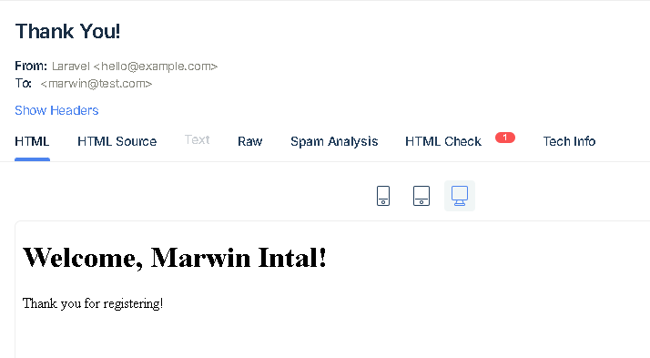

# Developer Assessment Exam

## Overview

This is a Laravel application designed for Trackerteer Developer Assessment Exam. 

## Requirements

- PHP >= 8.1.5
- Composer
- Database (MySQL)
- Email Delivery Platform (MailTrap)


## Installation

Follow these steps to get your Laravel project up and running:

```bash
### 1. Clone the repository

git clone https://github.com/marwinintal/test-tracketeer.git
cd test-tracketeer

### 2. Install dependencies

Run Composer to install the required PHP packages:

composer install

### 3. Environment configuration

Copy the .env.example file to .env:

cp .env.example .env

### 4. Update the .env file

Open the .env file in a text editor and configure the following settings:
Database Configuration
Update the database settings:

DB_CONNECTION=mysql
DB_HOST=127.0.0.1
DB_PORT=3306
DB_DATABASE=your_database_name
DB_USERNAME=your_username
DB_PASSWORD=your_password

### 5. Update the mail settings:

MAIL_MAILER=smtp
MAIL_HOST=smtp.mailtrap.io
MAIL_PORT=2525
MAIL_USERNAME=null
MAIL_PASSWORD=null
MAIL_ENCRYPTION=null
MAIL_FROM_ADDRESS=example@example.com
MAIL_FROM_NAME="${APP_NAME}

### 6. Generate application key:

php artisan key:generate

### 7. Run migrations:

php artisan migrate

### 8. Run migrations:

php artisan db:seed

### 9. Serve the application:

php artisan serve

```
### Note

Note: In your browser to test the [one to many] and [many to many]. You can log in using the seeded user:
“* **Username**: `johndoe` * **Password**: `password`”

